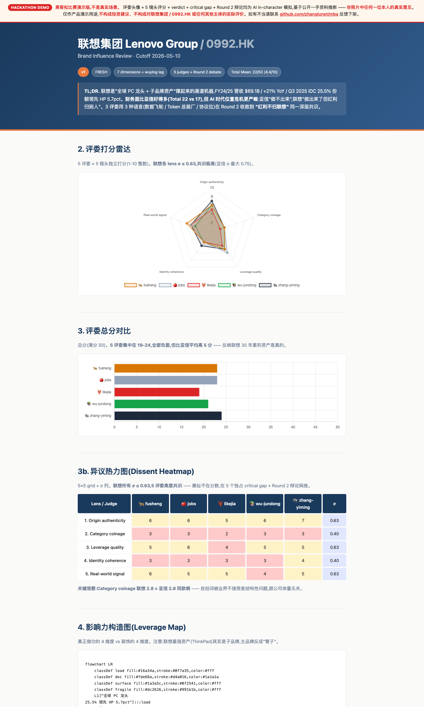

# MBA — Metric Brand Auditor

> 多智能体并行调研 + 五人评委打分,把"品牌影响力是怎么搭起来的"拆成可量化、可演化、可复盘的版本化报告。

`/mba` 文件夹下的核心 skill 名为 **Metric Brand Auditor**(MBA)—— 一条由 Lead 编排、子 agent 并行执行、5 位人物评委独立打分的品牌影响力审计流水线。整个仓库就是这条流水线的源代码 + 角色资料 + 历史报告。

## 团队 / Team

| 角色 | 成员 |
|---|---|
| 💡 创意 / Ideation | **Jason** |
| 🛠 实现 / Implementation | **清风** |
| 🧭 顾问 / Advisor | **John** |

🤖 协作 AI:Claude Opus 4.7(Anthropic)

---

## 看一眼 / Live preview

**网站 [mbabrand.com](https://mbabrand.com)**


**样例报告 [Lenovo 0992.HK](https://mbabrand.com/reports/lenovo/)** · [PDF](https://mbabrand.com/reports/lenovo/report.pdf) · [BotLearn 一键安装](https://www.botlearn.ai/skillhunt/v2/s/metric-brand-auditor)



**黑客松 5 分钟 Pitch 稿** · [Markdown](docs/hackathon/pitch-5min.md) · [HTML](docs/hackathon/pitch-5min.html)

---

## 一、设计思路:为什么要这样写

传统"品牌分析报告"有三个老问题:

1. **单线程单视角** —— 一个人看一切,容易陷入自家叙事或调研者偏好。
2. **不可复盘** —— 报告是一次性的,六个月后再看不知道哪些结论已变。
3. **打分主观、口径漂移** —— 没有固定维度和评委,跨品牌不可比,跨时间不可比。

MBA 用三个核心机制对应这三个问题:

| 老问题 | MBA 的应对 |
|---|---|
| 单线程单视角 | **N 路并行 sub-agent** 各调研一个维度 + **5 位人物评委**用各自世界观独立打分,Lead 只做合成 |
| 不可复盘 | **版本化目录**(`reports/<brand>/versions/v1_*.md/.html`),每次 evolution 写新版本,canonical `report.md` 滚动更新 |
| 打分漂移 | **固定 5 镜头 × 7 维度**(见下文),所有品牌、所有评委、所有时间点同口径打分 |

第二条 evolution 机制特别重要:Lead 在 Phase 0 路由器里会**先看**目标品牌的 `report.md` 是否存在 —— 存在就走 EVOLUTION 模式(只研究变了的维度、只重判变了的维度),不存在才走 FRESH 模式跑全流程。这让 MBA 能持续追踪一个品牌而不是只评一次。

---

## 二、产品结构框架

仓库分四层,每一层对应流水线的一个阶段。

```
mba/
├── metric-brand-auditor/         ← 编排层:整个流水线的主 SKILL
│   ├── SKILL.md                       Lead 的工作手册:Phase 0 路由 → Phase 1-5 全流程
│   ├── references/                    复用的子模块
│   │   ├── dimensions.md                7 个默认维度的提示词模板(创始叙事/产品定位/分发/社区/视觉/竞品/情绪)
│   │   ├── judge-prompt-template.md     喂给 5 位评委的统一打分模板(5 镜头 × 1-10 分)
│   │   ├── wuying-browser.md            云浏览器 leg 的开会话/驱动/拆除规范
│   │   └── html-report-template.md      最终 HTML 报告的脚手架(Chart.js + Mermaid)
│   └── reports/<brand-slug>/          每个品牌一个文件夹(运行 /mba <brand> 后生成)
│       ├── report.md                    当前 canonical 报告(滚动覆盖)
│       ├── report.html                  自包含 HTML 报告(雷达图 + 异议热力图 + 影响力构造图)
│       ├── versions/v{n}_{date}.{md,html}  每次 evolution 的不可变快照
│       ├── _raw/                        过程文件:每个维度子 agent 的原始输出 + 云浏览器日志 + Lead 合成
│       └── reviews/                     5 位评委的独立打分卡(fusheng/jobs/likejia/wu-jundong/zhang-yiming)
│
├── research/                     ← 工具层:复用的"PRD 多代理深度调研" skill
│   └── SKILL.md                       MBA 内部当作搜索建块,自身也可独立 `/research` 调用
│
├── *-perspective/                ← 评委层:5 套人物视角 skill
│   ├── fusheng-perspective/           傅盛(猎豹/OpenClaw)
│   ├── jobs-perspective/              Steve Jobs
│   ├── likejia-perspective/           李可佳(BotLearn/Aibrary)
│   ├── wu-jundong-perspective/        吴俊东(Aibrary 联创、前 TAL 战投)
│   └── zhang-yiming-perspective/      张一鸣(字节跳动)
│   每套 = 1 份 SKILL.md(含人格化触发规则、表达 DNA、anti-fabrication 约束)
│         + references/research/01-06.md(80% 一手来源的 6 路调研材料)
│         + scripts/(字幕下载、研究合并、质量检查工具)
│
└── wuying_open.py                ← 基建层:阿里云无影 AgentBay 浏览器一次性会话脚本
    test_wuying.py                     冒烟测试 API key
    .env.example / .env                WUYING_API_KEY 配置
```

### 流水线五阶段(FRESH 模式)

```
Phase 0  Router          Lead 检查 reports/<brand>/report.md 是否存在
                         → 存在 + 没传 --refresh ⇒ EVOLUTION 模式
                         → 否则 ⇒ FRESH 模式
   │
Phase 1  Discovery       Lead 起草 PRD(品牌一句话定位 / 7 默认维度 / 评委名单 / 是否走云浏览器)
   │                     GATE 1:用户确认或调整维度
   │
Phase 2  Parallel Search 一条消息派发 N 个 general-purpose sub-agent(每维度 1 个,最多 5 个/批)
   │                     + 1 个 wuying 云浏览器 sub-agent(--quick 时跳过)
   │                     每个 agent 把原始输出写到 _raw/dimension_n_*.md / wuying_browse.md
   │
Phase 3  Synthesis       Lead 读完所有 _raw/,产出 _raw/synthesis.md
   │                     (执行摘要 / 杠杆地图 / 脆弱边缘 / 跨维度矛盾 / 引用索引)
   │
Phase 4  5-Judge Panel   并行派发 5 个评委 agent,每人 LOAD 自己的 perspective skill
   │                     在 5 镜头(原创性 / 范畴命名 / 杠杆质量 / 身份一致性 / 真实信号)上各打 1-10 分
   │                     + 一句人格化金句 + 关键缺口 + 行动建议
   │                     独立打分,互不可见,落到 reviews/<judge>.md
   │
Phase 5  Lead Merge      Lead 合并 synthesis + 5 份 reviews,产出:
                         • report.md(canonical Markdown)
                         • report.html(自包含 HTML,Chart.js 雷达 + 异议热力图 + Mermaid 影响力流程图)
                         • versions/v{n}_<date>.{md,html}(冻结快照)
```

EVOLUTION 模式跳过 Phase 1 起草,改为 Phase 1E **diff plan**:列出"自上版以来可能变了什么",只重跑变了的维度 + 让评委只在受影响维度上重打分,然后 Phase 5 把版本号 +1 写新快照。

---

## 三、5 镜头 × 7 维度的打分坐标系

**7 个调研维度**(子 agent 跑的横向)

| # | 维度 | 关键问题 |
|---|---|---|
| 1 | 创始 & 起源叙事 | 谁讲的故事 / 创世神话省略了什么 / 一手 vs PR 复用 |
| 2 | 产品 & 定位 | 一句话定位 / 新品类宣称 / 主动比较与回避比较 |
| 3 | 分发 & 渠道 | 在哪里第一次被看到 / 自有 vs earned vs paid |
| 4 | 社区 & PR | 谁在站台 / 谁在攻击 / 各自利益 |
| 5 | 视觉 & 语言 | 命名 / slogan / 元符号(如 OpenClaw 的 🦞 ) |
| 6 | 竞品 & 格局 | 谁让出地盘 / 谁借用了它的语言 |
| 7 | 接收 & 情绪 | 搜索趋势 / 增长 / 媒体口径 |

**5 个打分镜头**(评委做的纵向)

1. **原创性**(Origin authenticity)—— 创始人/公司叙事是否站得住
2. **范畴命名**(Category coinage)—— 是否真的命名了一个新东西、且粘住了
3. **杠杆质量**(Leverage quality)—— 主导影响力渠道是否结构性可持续
4. **身份一致性**(Identity coherence)—— 视觉/语言/产品是否传递同一种感觉
5. **真实信号**(Real-world signal)—— 评委自己愿意为之下注的程度

7 维度 × 5 镜头不是矩阵相乘 —— 维度是"调研的输入",镜头是"评委的尺子",二者通过 `_raw/synthesis.md` 这个中间层耦合。

---

## 四、调用方式

```bash
/mba <brand>              # 标准全流程(Lead 自动判断 FRESH / EVOLUTION)
/mba OpenClaw             # 仓库内置的 demo case
/mba <brand> --quick      # 跳过云浏览器 leg(只走开放网,WebFetch+WebSearch)
/mba <brand> --refresh    # 强制 EVOLUTION 重跑(已有报告会归档到 versions/)
/mba <brand> --no-judges  # 只做合成,跳过 5 评委
/mba <brand> --focus 1,3,7  # 只调研指定维度
/mba list                 # 列出已审计的品牌 + 各自版本数
```

也可以单独调任何一个 perspective skill 做"一句话点评"(`/fusheng-perspective ...`)—— 那走的是单视角通道,不触发 MBA 流水线。

---

## 五、环境配置

本项目使用阿里云无影 AgentBay 服务做云浏览器 leg(免费 Lite 层即可,不需要 Pro)。

```bash
cp .env.example .env
# 编辑 .env,填入 WUYING_API_KEY=akm-xxx
# API key 从 https://wuying.aliyun.com 控制台 → AgentBay 应用获取
```

`.env` 已在 `.gitignore` 中,不会进版本库。本机调通后跑一次:

```bash
python3 test_wuying.py    # 冒烟测试,自动创建 → 取 endpoint → 删除
python3 wuying_open.py    # 创建会话并打印 SESSION_ID + RESOURCE_URL,会话保持活跃
```

> **注意**:免费 Lite 层 **拿不到 CDP 的 wss URL**(`get_endpoint_url()` 是 Pro/Ultra 独享)。
> 这意味着 `agent-browser` CLI 无法直接附着到云浏览器。
> Lite 层只能用 ResourceUrl 在本地浏览器里以"看画面 + 键鼠交互"的形式使用。
> Pipeline 在 Lite 层运行时会自动降级为 WebFetch + WebSearch + 用户手动观察的混合策略。

---

## 六、文件级路标(给读源码的人)

- 想读流水线的人 → `metric-brand-auditor/SKILL.md`(主手册,~600 行)
- 想看一个报告长啥样 → 跑一次 `/mba <你关注的品牌>`,在 `reports/<slug>/report.html` 生成
- 想加一个新维度 → `metric-brand-auditor/references/dimensions.md`
- 想改评委的打分模板 → `metric-brand-auditor/references/judge-prompt-template.md`
- 想换 HTML 报告的图表样式 → `metric-brand-auditor/references/html-report-template.md`
- 想加一个新评委 → 复制任何一个 `*-perspective/` 目录,改 `SKILL.md` 的 frontmatter 触发规则,跑 `scripts/` 里的调研流程,补 `references/research/01-06.md`
- 想理解多代理调研本身怎么写的 → `research/SKILL.md`(被 MBA 复用,也可独立 `/research` 调用)

## 许可与边界

- 5 套人物视角 skill 都基于**公开一手资料**(访谈、文章、播客 transcript),每套 SKILL.md 顶部有明确的 anti-fabrication 红线 —— 不替本人编造未公开内容。
- 仓库不附任何品牌的样板报告;每次 `/mba <brand>` 跑完的报告归用户所有,不入版本库,需自行管理隐私。
