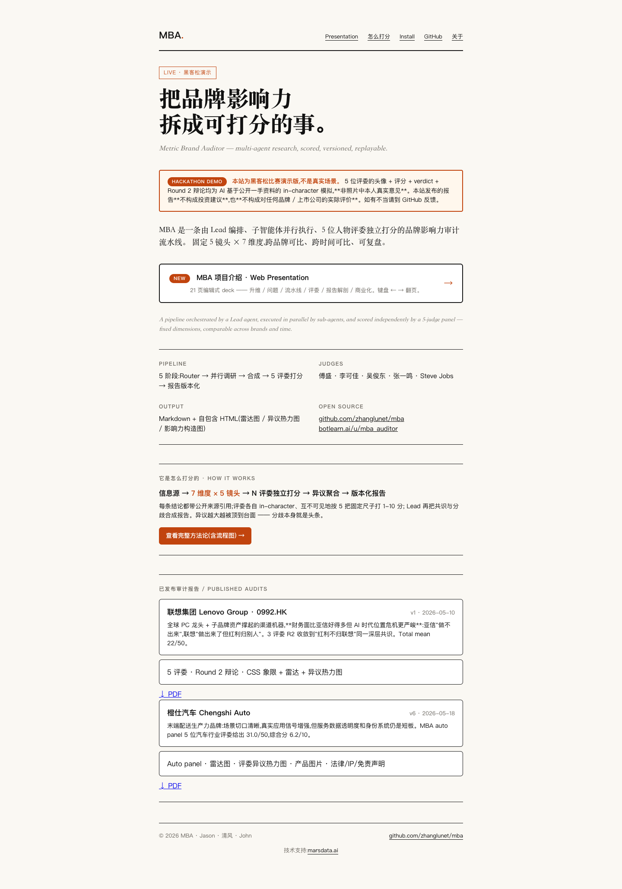
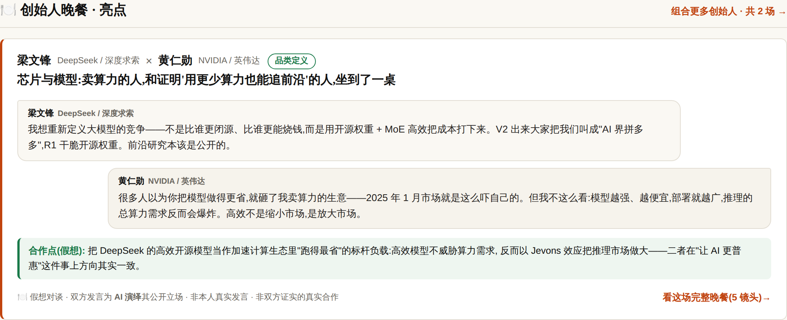
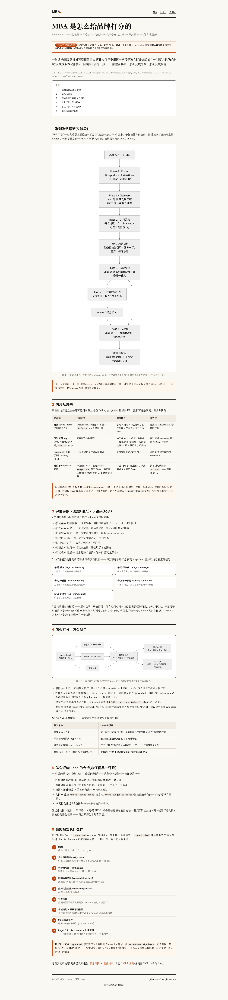
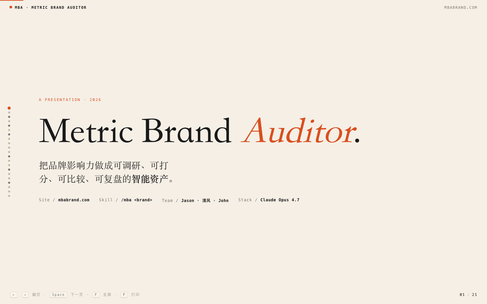
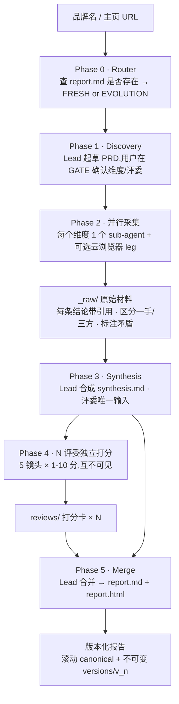
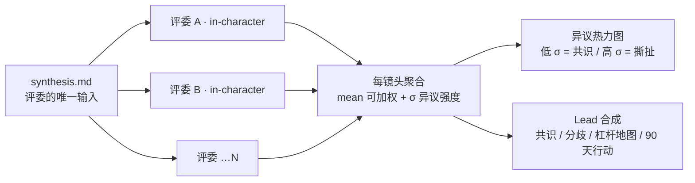

# MBA — Metric Brand Auditor

[](https://www.npmjs.com/package/mba-mcp-server)
[](packages/mcp-server/LICENSE)

> 多智能体并行调研 + 五人评委打分,把"品牌影响力是怎么搭起来的"拆成可量化、可演化、可复盘的版本化报告。

MCP server 已发布到 npm,一行接入(无需 clone):

```bash
npx -y mba-mcp-server@latest      # 或写进 claude_desktop_config.json,见 §5.1
```

`/mba` 文件夹下的核心 skill 名为 **Metric Brand Auditor**(MBA)—— 一条由 Lead 编排、子 agent 并行执行、人物评委 panel 独立打分的品牌影响力审计流水线。默认 panel 是 5 位评委,另有 9 套行业 panel 可按需替换 / 扩展(共 **10 套内置 panel、43 位评委,全部可运行**)。整个仓库就是这条流水线的源代码 + 角色资料 + 历史报告。

> **v0.6.1** —— 两种用法:① Claude Code **skill**(`/mba <brand>`);② 独立 **MCP server**([`mba-mcp-server`](https://www.npmjs.com/package/mba-mcp-server),已上 npm,16 工具含舆情监控),可接进 Claude Desktop / Cursor,支持**品牌订阅 → 舆情/定时/事件触发 → 自动重审 → delta 报告 → webhook/email 通知**的演化闭环。**本版**:24 品牌;**全部触发品牌 EVOLUTION 重审**(15 家按 watch 事件流 delta 重审、触发器全清零、克制到底)+ **首页每日自更新**(每日舆情 PR 自动 squash 合并);舆情自动化闭环——每日发现候选 → LLM 多 provider 预分类 → 自动折入 `events.yaml` 开 PR → 人工只审 diff(AI 判类不改分、合并=人工闸门)。见 [§5.1](#51-mcp-server--从任何-mcp-agent-调-mba) 与 [MCP 快速上手](docs/13-mcp-quickstart.md)。
> 新增:[全维度知识星图](https://mbabrand.com/starmap.html) + 每品牌私有星图;**舆情变化自动推送飞书群**([docs/19](docs/19-feishu-notify.md));**舆情驾驶舱看板**(`/watch/<slug>/cockpit.html`,管理层视角,[docs/20](docs/20-sentiment-cockpit-mapping.md))。

## 团队 / Team

| 角色 | 成员 |
|---|---|
| 💡 创意 / Ideation | **Jason** |
| 🛠 实现 / Implementation | **清风** |
| 🧭 顾问 / Advisor | **John** |

🤖 协作 AI:Claude (Anthropic)

---

## 看一眼 / Live preview

**网站 [mbabrand.com](https://mbabrand.com)**



**创始人晚餐 [Founder Dinners](https://mbabrand.com/collabs/)** —— 把两位创始人放一桌,按 5 镜头假想推演品牌×品牌合作机会(AI 演绎 · 非真实合作 · 诚实盒并列合作张力)



**评估方法论 [How it works](https://mbabrand.com/how-it-works.html)** —— 信息源 → 7 维度 × 5 镜头 → N 评委独立打分 → 异议聚合 → 版本化报告



**项目介绍 [Web Presentation](https://mbabrand.com/presentation/)** —— 21 页编辑式 deck(键盘 ← → 翻页)



**已发布报告（24 品牌 + 24 创始人 + 6 产业 + 3 场创始人晚餐）[mbabrand.com](https://mbabrand.com)** · [BotLearn 一键安装](https://www.botlearn.ai/en/community/u/mba_auditor)

**当前榜首**:Apple **8.84**(vc-en,Identity 9.6 全场最高)· NVIDIA 8.80(vc-en,EVOLUTION 重审后)· SpaceX 8.76(vc-en)· Amazon 8.72 · Hermes 8.64。实时榜单、全部 24 品牌、创始人/晚餐/产业、舆情信号与版本轨迹见 [mbabrand.com](https://mbabrand.com)(本表不再静态维护,以免与站点漂移)。

**黑客松 5 分钟 Pitch 稿** · [Markdown](docs/hackathon/pitch-5min.md) · [HTML](docs/hackathon/pitch-5min.html)

---

## 一、设计思路:为什么要这样写

传统"品牌分析报告"有三个老问题:

1. **单线程单视角** —— 一个人看一切,容易陷入自家叙事或调研者偏好。
2. **不可复盘** —— 报告是一次性的,六个月后再看不知道哪些结论已变。
3. **打分主观、口径漂移** —— 没有固定维度和评委,跨品牌不可比,跨时间不可比。

MBA 用三个核心机制对应这三个问题:

| 老问题 | MBA 的应对 |
|---|---|
| 单线程单视角 | **N 路并行 sub-agent** 各调研一个维度 + **人物评委 panel** 用各自世界观独立打分,Lead 只做合成 |
| 不可复盘 | **版本化目录**(`reports/<brand>/versions/v1_*.md/.html`),每次 evolution 写新版本,canonical `report.md` 滚动更新 |
| 打分漂移 | **固定 5 镜头 × 7 维度**(见下文),所有品牌、所有评委、所有时间点同口径打分 |

第二条 evolution 机制特别重要:Lead 在 Phase 0 路由器里会**先看**目标品牌的 `report.md` 是否存在 —— 存在就走 EVOLUTION 模式(只研究变了的维度、只重判变了的维度),不存在才走 FRESH 模式跑全流程。这让 MBA 能持续追踪一个品牌而不是只评一次。

---

## 二、产品结构框架

仓库分四层,每一层对应流水线的一个阶段。

```
mba/
├── metric-brand-auditor/         ← 编排层:整个流水线的主 SKILL
│   ├── SKILL.md                       Lead 的工作手册:Phase 0 路由 → Phase 1-5 全流程
│   ├── references/                    复用的子模块
│   │   ├── dimensions.md                7 个默认维度的提示词模板(创始叙事/产品定位/分发/社区/视觉/竞品/情绪)
│   │   ├── judge-prompt-template.md     喂给评委的统一打分模板(5 镜头 × 1-10 分),judge 列表从 panel 读取
│   │   ├── wuying-browser.md            云浏览器 leg 的开会话/驱动/拆除规范
│   │   └── html-report-template.md      最终 HTML 报告的脚手架(Chart.js + Mermaid + Legal/IP)
│   ├── panels/                       ← 评委编组层:命名 panel 的 yaml 配置
│   │   ├── default.yaml                 [可运行] 默认阵容:傅盛 / Jobs / 李可佳 / 吴俊东 / 张一鸣
│   │   ├── auto.yaml                    [可运行] 汽车 / EV:马斯克 / 雷军 / 李想 / 何小鹏 / 李斌
│   │   ├── security-cn-global.yaml      [可运行] 安全 6 人:周鸿祎 / 张明正 / 任正非 / 黄仁勋 / 马斯克 / Satya
│   │   ├── ai-app-cn.yaml               [可运行] AI 应用层:杨植麟 / 王慧文 / 周鸿祎 / 傅盛 / 朱啸虎
│   │   ├── edu-cn.yaml                  [可运行] 教育:俞敏洪 / 张邦鑫 / 李可佳 / 吴俊东 / Sal Khan
│   │   ├── vc-en.yaml                   [可运行] 英文 VC:pmarca / paulg / pthiel / naval / rhoffman
│   │   ├── vc-cn.yaml                   [可运行] 中文 VC:朱啸虎 / 张磊 / 徐新 / 雷军 / 沈南鹏
│   │   ├── consumer-cn.yaml             [可运行] 消费:江南春 / 钟睒睒 / 罗永浩 / 阳萌 / 张兰
│   │   ├── cross-border.yaml            [可运行] 出海:黄峥 / 阳萌 / 周受资 / 陈年 / 庄帅
│   │   ├── luxury-en.yaml               [可运行] 奢侈品:Arnault / Cucinelli / Wintour / Tom Ford / Burton(全英文)
│   │   ├── industries.yaml              行业名 → panel 名映射表,被 --industry 查询(本身不是 panel)
│   │   └── README.md                    panel yaml 字段说明 + 怎么写一个新 panel
│   └── reports/<brand-slug>/          每个品牌一个文件夹(运行 /mba <brand> 后生成)
│       ├── report.md                    当前 canonical 报告(滚动覆盖)
│       ├── report.html                  自包含 HTML 报告(雷达图 + 异议热力图 + 影响力构造图 + 法律声明)
│       ├── panel.yaml                   这个品牌锁定了哪一套 panel(首次运行写入,evolution 默认沿用)
│       ├── versions/v{n}_{date}.{md,html}  每次 evolution 的不可变快照
│       ├── _raw/                        过程文件:每个维度子 agent 的原始输出 + 云浏览器日志 + Lead 合成
│       └── reviews/                     评委独立打分卡(每位 judge-slug 一个 .md)
│
├── research/                     ← 工具层:复用的"PRD 多代理深度调研" skill
│   └── SKILL.md                       MBA 内部当作搜索建块,自身也可独立 `/research` 调用
│
├── perspectives/                 ← 评委层:43 套 production 人物视角 skill(目录名 <slug>-perspective/)
│   ├── default panel 的 5 位:
│   │   fusheng(傅盛)/ jobs(Steve Jobs)/ likejia(李可佳)/
│   │   wu-jundong(吴俊东)/ zhang-yiming(张一鸣)
│   ├── auto panel 的 5 位:
│   │   musk(马斯克)/ leijun(雷军)/ lixiang(李想)/
│   │   hexiaopeng(何小鹏)/ libin(李斌)
│   └── security panel 的 5 位(+ 复用 musk):
│       zhouhongyi(周鸿祎)/ zhangmingzheng(张明正)/ renzhengfei(任正非)/
│       jensenhuang(黄仁勋)/ satyanadella(Satya Nadella)
│   每套 = 1 份 SKILL.md(含人格化触发规则、表达 DNA、anti-fabrication + self-conflict 约束)
│         + references/research/01-06.md(80% 一手来源的 6 路调研材料)
│         + 部分含 quotes.md(URL 锚定金句库)+ 共享工具见 scripts/perspective-tools/
│   H2 结构由 metric-brand-auditor/references/perspective-structure-spec.md 规定,CI 用 check_structure.py 校验
│   注:2026-06 之前 *-perspective/ 在根目录,现统一收纳到 perspectives/ 下;mba SKILL.md 同时兼容旧布局
│
├── scripts/
│   ├── validate_panels.py           ← 校验所有 panel yaml(CI 跑这个,零依赖)
│   ├── print_report.sh              ← report.html → report.pdf(headless Chrome,就地覆盖)
│   ├── perspective-tools/           ← 字幕下载、研究合并、质量检查、结构校验等 perspective 共用工具
│   │   └── check_structure.py           校验 *-perspective/SKILL.md 的 H2 结构(CI 跑这个)
│   └── wuying/                      ← 阿里云无影 AgentBay helper + smoke test
├── assets/judges/                   ← 评委插画头像(严禁真人照片)
├── published/reports/               ← 已确认可公开发布的报告源(显式 git add -f 才入库)
├── packages/mcp-server/             ← mba-mcp-server:MBA 的 MCP 封装(TypeScript,16 工具,已发布 npm)
├── site/                            ← mbabrand.com 的源:index.html + build.sh(Cloudflare Pages)
├── docs/                            ← 完整设计文档 01-16 + mcp-server-design + weekly 周报 + hackathon 资料
├── .github/workflows/panel-validation.yml ← CI:校验 panel / 结构 / py_compile / shell / site build
└── .env.example / .env              WUYING_API_KEY 配置(.env 不入库)
```

### 流水线五阶段(FRESH 模式)

```
Phase 0  Router          Lead 检查 reports/<brand>/report.md 是否存在
                         → 存在 + 没传 --refresh ⇒ EVOLUTION 模式
                         → 否则 ⇒ FRESH 模式
   │
Phase 1  Discovery       Lead 起草 PRD(品牌一句话定位 / 7 默认维度 / 评委名单 / 是否走云浏览器)
   │                     GATE 1:用户确认或调整维度
   │
Phase 2  Parallel Search 一条消息派发 N 个 general-purpose sub-agent(每维度 1 个,最多 5 个/批)
   │                     + 1 个 wuying 云浏览器 sub-agent(--quick 时跳过)
   │                     每个 agent 把原始输出写到 _raw/dimension_n_*.md / wuying_browse.md
   │
Phase 3  Synthesis       Lead 读完所有 _raw/,产出 _raw/synthesis.md
   │                     (执行摘要 / 杠杆地图 / 脆弱边缘 / 跨维度矛盾 / 引用索引)
   │
Phase 4  N-Judge Panel   Lead 读取 panel.yaml (品牌已绑定 / CLI 覆盖 / 默认 default)
   │                     并行派发 panel 里列出的 N 个评委 agent,每人 LOAD 自己的 perspective skill
   │                     在 5 镜头(原创性 / 范畴命名 / 杠杆质量 / 身份一致性 / 真实信号)上各打 1-10 分
   │                     + 一句人格化金句 + 关键缺口 + 行动建议
   │                     独立打分,互不可见,落到 reviews/<judge>.md
   │
Phase 5  Lead Merge      Lead 合并 synthesis + 5 份 reviews,产出:
                         • report.md(canonical Markdown)
                         • report.html(自包含 HTML,Chart.js 雷达 + 异议热力图 + Mermaid 影响力流程图 + Legal/IP/Disclaimer)
                         • versions/v{n}_<date>.{md,html}(冻结快照)
```

EVOLUTION 模式跳过 Phase 1 起草,改为 Phase 1E **diff plan**:列出"自上版以来可能变了什么",只重跑变了的维度 + 让评委只在受影响维度上重打分,然后 Phase 5 把版本号 +1 写新快照。

---

## 三、5 镜头 × 7 维度的打分坐标系

**7 个调研维度**(子 agent 跑的横向)

| # | 维度 | 关键问题 |
|---|---|---|
| 1 | 创始 & 起源叙事 | 谁讲的故事 / 创世神话省略了什么 / 一手 vs PR 复用 |
| 2 | 产品 & 定位 | 一句话定位 / 新品类宣称 / 主动比较与回避比较 |
| 3 | 分发 & 渠道 | 在哪里第一次被看到 / 自有 vs earned vs paid |
| 4 | 社区 & PR | 谁在站台 / 谁在攻击 / 各自利益 |
| 5 | 视觉 & 语言 | 命名 / slogan / 元符号(如 OpenClaw 的 🦞 ) |
| 6 | 竞品 & 格局 | 谁让出地盘 / 谁借用了它的语言 |
| 7 | 接收 & 情绪 | 搜索趋势 / 增长 / 媒体口径 |

**5 个打分镜头**(评委做的纵向)

1. **原创性**(Origin authenticity)—— 创始人/公司叙事是否站得住
2. **范畴命名**(Category coinage)—— 是否真的命名了一个新东西、且粘住了
3. **杠杆质量**(Leverage quality)—— 主导影响力渠道是否结构性可持续
4. **身份一致性**(Identity coherence)—— 视觉/语言/产品是否传递同一种感觉
5. **真实信号**(Real-world signal)—— 评委自己愿意为之下注的程度

7 维度 × 5 镜头不是矩阵相乘 —— 维度是"调研的输入",镜头是"评委的尺子",二者通过 `_raw/synthesis.md` 这个中间层耦合。

> 📖 本节的**图文详解版**同时发布在 **[mbabrand.com/how-it-works](https://mbabrand.com/how-it-works.html)**(信息源 → 打分 → 报告,带流程图)。

---

## 评估方法论 · How it works:信息源 → 打分 → 报告

一句话:**先把品牌拆成可引用的事实,再让多位评委用同一把尺子独立打分,最后由 Lead 把"共识"和"分歧"合成成版本化报告。** 下面拆开讲每一步的数据从哪来、怎么变成分数、怎么变成报告。

### M1. 端到端数据流(5 阶段)



关键设计:评委**只读 `synthesis.md` 这一个中间层**,不直接看 7 份原始维度文件,也看不到彼此的打分卡 —— 这保证了打分独立、口径统一、可复现。

### M2. 信息从哪来(Information sources)

所有结论都建立在**公开可访问来源**上,每条 finding 在 `_raw/` 里都带 URL 引用,可逐条回溯。

| 信息源 | 采集方式 | 覆盖什么 | 缺失时 |
|---|---|---|---|
| **开放网 sub-agent**(每维度 1 个) | `WebSearch`(中英各 4-6 条)+ `WebFetch`(top 3 实质 URL) | 官网 / 新闻 / 行业媒体 / 公开社媒 / 产品页 / 公开投诉样本 | 维度标 `INCOMPLETE`,合成时注明 |
| **云浏览器 leg**(无影 AgentBay,可选,`--quick` 跳过) | 真实浏览器会话驱动 | X/Twitter · 小红书 · Bilibili · 36kr/虎嗅/钛媒体 · 应用商店等 JS 重 / 登录墙 / 反爬站 | 自动降级 web-only,报告标 `N/A`,不伪造 |
| **`research` skill**(可选 building block) | PRD 驱动的多代理深度调研 | 某个维度需要更深时复用 | 退回直接 WebSearch+WebFetch |
| **评委 perspective 资料** | 每位评委 LOAD 自己的 `*-perspective`,基于 80% 一手访谈/文章/播客 transcript 的 6 路调研材料 | 评委"怎么看"的世界观、决策启发式、表达 DNA | 找不到则该评委 `MISSING`,panel 降级 N-of-M |

**边界(写进每份报告的 Legal/IP/Disclaimer)**:只引用公开资料,不使用非公开文件、商业秘密、未授权数据库;拿不到的数据标 `N/A` 而非编造;评委对自己强关联的公司/产品默认 `--panel-drop`,保留则只作"创始人自检"不计入中立横评。

### M3. 评估参数:7 维度(输入)× 5 镜头(尺子)

- **7 个调研维度**(横向,sub-agent 跑):① 创始 & 起源叙事 ② 产品 & 定位 ③ 分发 & 渠道 ④ 社区 & PR ⑤ 视觉 & 语言 ⑥ 竞品 & 格局 ⑦ 接收 & 情绪(详见上文 §三)。
- **5 个打分镜头**(纵向,评委打):① 原创性 ② 范畴命名 ③ 杠杆质量 ④ 身份一致性 ⑤ 真实信号。
- 维度是"信息的输入面",镜头是"评判的尺子"。评委不是按维度逐项打分,而是从 `synthesis.md` 里**抽取**自己看重的信号,投射到 5 把尺子上 —— 所以同一镜头不同评委会给不同分,这正是价值所在。

### M4. 怎么打分、怎么聚合(Scoring)



- **谁打**:解析出的 panel 里 N 位评委(default 5 / auto 5 / security 6),每位先 LOAD 自己的 perspective skill,以第一人称、本人词汇与决策风格作答。
- **打什么**:5 个镜头各 **1-10 整数** + 一段 in-character 推理 + 一句"像本人会说的"签名金句;另给 **Verdict**(一句结论)/ **Critical gap**(只有该视角能点出的盲点)/ **Brand action**(下一步该做什么)。
- **独立性**:评委互不可见对方打分卡(prompt 里显式 `DO NOT read other judges' files`),防止趋同 —— 评委趋同 = outsider 视角价值丢失。
- **聚合**:每镜头算 `mean`(可按 `weight` 加权)与 `σ`(跨评委标准差 = 异议强度);雷达图 / 异议热力图按 **raw score** 画,不被权重污染。

**异议是产品,不是噪声 —— 质量阈值会强制把分歧顶到台面:**

| 触发条件 | Lead 必须做 |
|---|---|
| 某镜头 σ > 2.0 | 写一段专门段落,引用打分最高与最低评委的原话,不许用均值糊过去 |
| 单评委偏离镜头均值 > 2.5σ | 把该评委推理**原文**呈现,不平滑进均值 |
| 评委总分极差(max−min)> 8 | 在 TL;DR 里直接写"这个品牌两极分化"——分歧本身就是头条 |
| 出现"私下了解/内部消息"等编造红旗 | 拒收该打分卡,重跑该评委(anti-fabrication 触发) |

### M5. 怎么评价(Lead 的合成,非任何单一评委)

Lead 在 Phase 3/5 做只有"全局视角"才能做的判断,输出到报告:

- **杠杆地图(Leverage map)**:哪个维度在做实功(真正撑起影响力),哪个只是装饰。
- **脆弱边缘(Fragile edges)**:品牌在哪一点上单点依赖(一个渠道 / 一个人 / 一个叙事)。
- **跨维度矛盾**:维度 N 的发现与维度 M 打架在哪。
- **共识 vs 分歧**:`Where judges agree` 给方向,`Where judges disagree`(报告最有价值的一节)给"哪里有故事"。
- **90 天行动建议**:3-5 条按 leverage 排序的具体动作。

### M6. 最终报告长什么样(Output)

每次标准运行产出 `report.md`(canonical Markdown,给工具/LLM 消费)+ `report.html`(自包含单文件,给人看,只引 Chart.js / Mermaid CDN,离线可读)。HTML 自上而下的可视化块:

1. **Hero** — 品牌 / 版本 / 模式 / 一句 TL;DR
2. **评分雷达图**(Chart.js radar)— 5 镜头为辐条,每评委一条彩色多边形,共识区一眼可见
3. **评分条形图** + **3b. 异议热力图**(5 镜头 × N 评委 + σ 列,红→黄→绿)
4. **影响力构造图**(Mermaid flowchart)— 源维度 → 放大器 → 可观察表面,边标杠杆假设
5. **品牌定位象限**(Mermaid quadrant)— 品牌 + 3-5 竞品落点
6. **评委卡片** — 插画头像(严禁真人照片)+ verdict + 金句 + 分数行
7. **情绪趋势**(有时间序列才画)· 8. **品牌精髓脑图**(Mermaid mindmap)
9. **90 天行动建议**(带 leverage 徽章)· 10. **Legal/IP/Disclaimer** · 11. **引用索引**

**版本化与复盘**:`report.md` 滚动覆盖为最新版,每次 evolution 冻结一份 `versions/v{n}_<date>.{md,html}`。再次跑同一品牌走 **EVOLUTION 模式** —— 只重研究 / 重打分"变了的维度",版本号 +1,于是六个月的品牌影响力演化变成一条可对比的时间线(HTML 里用 Mermaid `gitGraph` 呈现 v1→v2→v3)。

---

## 四、评委 panel:换一套评委 / 保存一套 / 按品牌调用

5 镜头是固定的尺子,**坐在尺子后面打分的人是可换的**。MBA 把"哪 N 位评委上场"这个决定从 `SKILL.md` 里抽出来,放进 `metric-brand-auditor/panels/` 下的命名 yaml,一个 yaml = 一个 panel。

三件事各自独立:**建一套 / 存一套 / 按品牌调用**。

### 4.1 Panel 是什么 —— 一份 yaml

```yaml
# metric-brand-auditor/panels/default.yaml
name: default
display_name: Default 5-Judge Panel
description: MBA 默认上场阵容;混合中英文 / 创始人视角 / VC 视角 / 字节系产品视角
judges:
  - slug: fusheng              # 必填,跟 ${PERSPECTIVES_PATH}/<slug>-perspective 对齐
    display_name_cn: 傅盛
    display_name_en: Fu Sheng
    language: zh               # zh / en — 决定该评委在 reviews/*.md 里用哪种语言落笔
    portrait: 傅盛.jpg         # 可选,相对 ${IMAGES_DIR};没有就走 emoji / monogram 兜底
    weight: 1.0                # 可选,默认 1.0;Phase 5 算 mean 时的权重
  - slug: jobs
    display_name_cn: 乔布斯
    display_name_en: Steve Jobs
    language: en
    portrait: jobs.jpg
  - slug: likejia
    display_name_cn: 李可佳
    display_name_en: Ethan Li
    language: zh
    portrait: 李可佳.jpg
  - slug: wu-jundong
    display_name_cn: 吴俊东
    display_name_en: Frank Wu
    language: zh
    portrait: 吴俊东.jpg
  - slug: zhang-yiming
    display_name_cn: 张一鸣
    display_name_en: Zhang Yiming
    language: zh
    portrait: 张一鸣.jpg
```

字段约束:
- `slug` 必须能在 `${PERSPECTIVES_PATH}`(继承自 SKILL.md 的 Path resolution)里找到 `<slug>-perspective/SKILL.md`,否则该评委 `MISSING`,panel 自动降级为 N-of-M
- panel 至少留 1 位评委,不强制 5 位 —— 3 人 panel / 7 人 panel 都合法
- `weight` 只在 Phase 5 的 mean 里生效,雷达图 / 异议热力图按 raw score 画,不被权重污染

### 4.2 新建一套评委 —— 端到端 6 步

> 假设你想加一个新评委 `pmarca`(Marc Andreessen)进 panel。

```text
1. 复制视角 skill 模板
   cp -r perspectives/fusheng-perspective perspectives/pmarca-perspective

2. 改 perspectives/pmarca-perspective/SKILL.md frontmatter
   - name: pmarca-perspective
   - description: Marc Andreessen / a16z 创始合伙人 ...
   - 显式触发:「用 pmarca 视角」「Andreessen 会怎么看」
   - 不要激活:用户问 Netscape 浏览器代码细节 / pmarca 家庭隐私 ...
   - anti-fabrication 段:不替本人编造未公开内容、不伪造私下场景

3. 跑 6 路并行调研,填 references/research/01-06.md
   /research Marc Andreessen --persona-mode
   (或手工:01 身份卡 / 02 表达 DNA / 03 心智模型 / 04 决策启发式 /
    05 反共识立场 / 06 anti-fabrication 边界)

4. (可选)放一张插画头像
   assets/judges/pmarca.jpg  ← 插画 / 卡通 / monogram 都行,严禁真人照片

5. 单独跑一次,确认 perspective 自己可用
   /pmarca-perspective 帮我看一眼龙虾这个事

6. 注册进一个 panel
   编辑 metric-brand-auditor/panels/<panel-name>.yaml,在 judges: 下追加 pmarca 条目
```

第 3 步是大头 —— 评委之所以"像"靠的是 80% 一手访谈 / 文章 / 播客 transcript 的高密度调研材料,不是 SKILL.md 里的几句口令。`research/` skill 已经把 6 路并行调研模板化了,新评委照着跑就行。

### 4.3 保存一套 panel —— 起个名字写进 yaml 就完事

panel 没有"保存"动作 —— 写进 `metric-brand-auditor/panels/<name>.yaml` 就是保存了。Git 跟踪,跨机器同步。

常用模式:

仓库当前自带的 panel(`status:` 区分**可运行** vs **SKELETON 占位**):

```bash
metric-brand-auditor/panels/
# ── 可运行(评委 perspective skill 已建齐,能真打分)──────────────
├── default.yaml            # 兜底:傅盛 + Jobs + 李可佳 + 吴俊东 + 张一鸣
├── auto.yaml               # 汽车 / EV:马斯克 + 雷军 + 李想 + 何小鹏 + 李斌
├── security-cn-global.yaml # 安全 6 人:周鸿祎 + 张明正 + 任正非 + 黄仁勋 + 马斯克 + Satya
├── ai-app-cn.yaml          # AI 应用层:杨植麟 + 王慧文 + 周鸿祎 + 傅盛 + 朱啸虎(v1 production-seed)
├── edu-cn.yaml             # 教育:俞敏洪 + 张邦鑫 + 李可佳 + 吴俊东 + Sal Khan(v1 production-seed)
├── vc-en.yaml              # 英文 VC:pmarca + paulg + pthiel + naval + rhoffman(v1 production-seed)
├── vc-cn.yaml              # 中文 VC:朱啸虎 + 张磊 + 徐新 + 雷军 + 沈南鹏(v1 production-seed)
├── consumer-cn.yaml        # 中文消费品:江南春 + 钟睒睒 + 罗永浩 + 阳萌 + 张兰(v1 production-seed)
├── cross-border.yaml       # 出海 / 跨境:黄峥 + 阳萌 + 周受资 + 陈年 + 庄帅(v1 production-seed)
└── luxury-en.yaml          # 奢侈品:Arnault + Cucinelli + Wintour + Tom Ford + Burton(全英文,v1 production-seed)
# ── 10/10 panel 全部可运行(v1 production-seed),已无 skeleton ──
# ── 不是 panel,是映射表 ────────────────────────────────────
└── industries.yaml         # 行业名 → panel 名,被 --industry 查询
```

SKELETON panel 仍可用于 synthesis-only 速读;等评委 perspective 填齐、删掉
`status: skeleton` 字段,它就自动升级为可运行。下次 `--panel auto` 直接复用 ——
不需要改 SKILL.md,不需要 deploy。字段定义见
[`metric-brand-auditor/panels/README.md`](metric-brand-auditor/panels/README.md)。

### 4.4 不同品牌调用不同 panel —— 四层优先级

每次 `/mba <brand>` 走以下顺序解析,先命中先用:

```
CLI flag (--panel <name>)
  > CLI flag (--industry <name>) → industries.yaml → panel name
  > reports/<brand-slug>/panel.yaml 里 panel: <name> 字段
  > metric-brand-auditor/panels/default.yaml
```

具体规则:

| 场景 | 行为 |
|---|---|
| `/mba lenovo` 首次跑 | 用 `default` panel,跑完把 `panel: default` 写进 `reports/lenovo/panel.yaml` |
| `/mba byd --industry auto` 首次跑 | 经 industries.yaml 解析到 `auto`,写进 `reports/byd/panel.yaml`(品牌从此默认绑定 auto) |
| `/mba byd`(已有 v1) | 走 EVOLUTION,从 `reports/byd/panel.yaml` 读出绑定的 `auto`,不重选 |
| `/mba byd --panel security-cn-global`(已有 v1) | EVOLUTION 用新 panel —— 但 Lead 会 GATE 一次告诉你"评委换了,旧 reviews/ 不可直接 diff,会全员重打",等用户确认 |
| `/mba lenovo --panel <skeleton>` | panel 标了 `status: skeleton` 时,Lead 提示并自动降级为 synthesis-only(跳过 Phase 4) |
| `/mba lenovo --no-judges` | 跳过 Phase 4,panel 解析也跳过 |

`reports/<brand>/panel.yaml` 长这样:

```yaml
# 由 Phase 0 router 在首次运行后写入
panel: default                  # 引用 panels/default.yaml
locked_at: 2026-05-17           # 首次绑定日期
mba_version: 0.2.24             # 当时的 mba 版本号(后续可观测兼容性)
overrides:                      # 可选 —— 在 panel 之上的局部调整
  drop: []                      # 跳过这次不出场的评委 slug
  add: []                       # 临时加挂的评委(不写回 panels/)
```

### 4.5 新增 CLI 子命令

为支持 panel,`/mba` 新增以下子命令(由 SKILL.md 在后续版本接入,本节先固化语义):

```bash
/mba panels                       # 列出 panels/ 下所有 panel,显示 judge 列表 + 用过的次数
/mba panels show <name>           # 打印一个 panel 的完整 yaml 内容
/mba panels new <name>            # 从 default.yaml 复制出一份新 panel 骨架到 panels/<name>.yaml
/mba <brand> --panel <name>       # 该次运行用指定 panel(首次会写回品牌的 panel.yaml)
/mba <brand> --panel-add <slug>   # 在本次运行临时追加一位评委,不改 panel 文件
/mba <brand> --panel-drop <slug>  # 在本次运行临时跳过一位评委,不改 panel 文件
```

`--panel-add` / `--panel-drop` 走 `overrides`,只影响本次输出,不修改 `panels/<name>.yaml` —— 用来做"这次想加 pmarca 试一下,但还不确定要不要进 vc-en 常驻"这种探索。

### 4.6 评委 panel 与品牌之间的耦合面 —— 不要破坏的几条

写新 panel / 改品牌绑定时这几条不能踩:

1. **改了 panel 后不要去改旧 `versions/v{n}_*.md`** —— 那是当时 panel 给出的冻结快照,不该被新评委的分数污染。新 panel 重打分,在 `v{n+1}` 写新版本。
2. **旧的 `reviews/<judge-slug>.md` 留着** —— 哪怕 panel 里删掉了该 judge,它的历史打分仍在,EVOLUTION 模式可以 diff(`v2 by pmarca` vs `v1 by zhang-yiming`)。
3. **panel 切换会写进 `versions/v{n+1}` 的 metadata** —— Phase 5 报告头部必须显式列出 `Panel: auto`,不要让读者以为"分数变了"是品牌变了,实际上是评委换了。
4. **判分语言跟随 `judges[*].language`,不要被品牌语种盖住** —— 给中文品牌找 Jobs 打分,他还是用英文,Lead 再翻译进合成报告。

---

## 五、调用方式

```bash
/mba <brand>              # 标准全流程(Lead 自动判断 FRESH / EVOLUTION,用 default panel 或品牌已绑定 panel)
/mba OpenClaw             # 仓库内置的 demo case
/mba <brand> --quick      # 跳过云浏览器 leg(只走开放网,WebFetch+WebSearch)
/mba <brand> --refresh    # 强制 EVOLUTION 重跑(已有报告会归档到 versions/)
/mba <brand> --no-judges  # 只做合成,跳过评委 panel
/mba <brand> --focus 1,3,7  # 只调研指定维度
/mba <brand> --panel <name>       # 这次用指定 panel(首次会写回 reports/<brand>/panel.yaml)
/mba <brand> --panel-add <slug>   # 本次临时加一位评委,不改 panel 文件
/mba <brand> --panel-drop <slug>  # 本次临时跳过一位评委,不改 panel 文件
/mba list                 # 列出已审计的品牌 + 各自版本数 + 绑定的 panel
/mba panels               # 列出所有 panel,显示 judge 列表
/mba panels show <name>   # 打印一个 panel 的完整 yaml
/mba panels new <name>    # 从 default.yaml 复制出骨架到 panels/<name>.yaml
```

也可以单独调任何一个 perspective skill 做"一句话点评"(`/fusheng-perspective ...`)—— 那走的是单视角通道,不触发 MBA 流水线。

### 5.1 MCP Server —— 从任何 MCP agent 调 MBA

除了 Claude Code skill,MBA 还封装成了 **MCP server**([`mba-mcp-server`](https://www.npmjs.com/package/mba-mcp-server),TypeScript,stdio),**已发布到 npm**,一行接入、无需 clone:

```bash
npx -y mba-mcp-server@latest      # 直接跑,或写进下面的 claude_desktop_config.json
```


```jsonc
// claude_desktop_config.json
{
  "mcpServers": {
    "mba": {
      "command": "npx",
      "args": ["-y", "mba-mcp-server@latest"],
      "env": { "ANTHROPIC_API_KEY": "sk-ant-..." }
    }
  }
}
```

然后直接说"用 mba 审一下 Anthropic",agent 会走 `propose_audit → confirm_audit → get_status → fetch_report`。共 **16 个工具**(8 核心审计 + 6 演化追踪 + 2 舆情监控),支持**品牌订阅 + 自动重审 + delta 报告 + webhook/email 通知**——品牌有变化时自动重审并推送;舆情事件流(`record_watch_event`)在 P0 或触发规则命中时经同一订阅链路下发重审建议(只建议、不改分)。增量重跑让演化审计成本从 ~$3 降到 ~$0.4/次。

设 `MBA_WEB_SEARCH=1` 可让研究阶段用 **Anthropic 服务端实时联网搜索**(带真实来源 URL,写入 `_raw/`),搜索在 Anthropic 侧发生、**不需要沙箱自身出网**,锁死出站策略的环境里也能用。仅研究阶段联网,判审/合成/合并不联网。

完整用法见 [`docs/13-mcp-quickstart.md`](docs/13-mcp-quickstart.md);源码与开发/发布说明见 [`packages/mcp-server/`](packages/mcp-server)。

---

## 六、环境配置

本项目使用阿里云无影 AgentBay 服务做云浏览器 leg(免费 Lite 层即可,不需要 Pro)。

```bash
cp .env.example .env
# 编辑 .env,填入 WUYING_API_KEY=akm-xxx
# API key 从 https://wuying.aliyun.com 控制台 → AgentBay 应用获取
```

`.env` 已在 `.gitignore` 中,不会进版本库。本机调通后跑一次:

```bash
python3 scripts/wuying/smoke_test.py    # 冒烟测试,自动创建 → 取 endpoint → 删除
python3 scripts/wuying/open.py    # 创建会话并打印 SESSION_ID + RESOURCE_URL,会话保持活跃
```

> **注意**:免费 Lite 层 **拿不到 CDP 的 wss URL**(`get_endpoint_url()` 是 Pro/Ultra 独享)。
> 这意味着 `agent-browser` CLI 无法直接附着到云浏览器。
> Lite 层只能用 ResourceUrl 在本地浏览器里以"看画面 + 键鼠交互"的形式使用。
> Pipeline 在 Lite 层运行时会自动降级为 WebFetch + WebSearch + 用户手动观察的混合策略。

---

## 七、文件级路标(给读源码的人)

- 想读流水线的人 → `metric-brand-auditor/SKILL.md`(主手册,~1000 行)
- 想要系统化的设计 / 使用 / 扩展文档 → [`docs/`](docs/)(01-prd → 08-extending,索引见 `docs/README.md`)
- 想看已发布的报告 → [`mbabrand.com`](https://mbabrand.com)(22 品牌,含 NVIDIA / Apple / Google / Microsoft / Amazon / Huawei / SpaceX / OpenAI / 智谱 等)或直接看 [`published/reports/`](published/reports/)
- 想加一个新维度 → `metric-brand-auditor/references/dimensions.md`
- 想改评委的打分模板 → `metric-brand-auditor/references/judge-prompt-template.md`
- 想换 HTML 报告的图表样式 → `metric-brand-auditor/references/html-report-template.md`
- 想加一个新评委(persona) → 看本文§4.2 的 6 步 + `metric-brand-auditor/references/perspective-structure-spec.md`(H2 结构规范);模板目录在 `perspectives/<slug>-perspective/`
- 想存 / 切 / 查 panel → `metric-brand-auditor/panels/`(字段定义见本文§4.1 与 `panels/README.md`),校验用 `python3 scripts/validate_panels.py`
- 想给某个品牌换一套评委 → `/mba <brand> --panel <name>`(详见本文§4.4)
- 想理解多代理调研本身怎么写的 → `research/SKILL.md`(被 MBA 复用,也可独立 `/research` 调用)
- 想把报告发到 mbabrand.com → 见 [`site/README.md`](site/README.md)(Cloudflare Pages + `site/build.sh`)
- 想知道 CI 校验什么 → `.github/workflows/panel-validation.yml`(panel / 结构 / py_compile / shell / site build)

## 许可与边界

- Production 人物视角 skill 都基于**公开一手资料**(访谈、文章、播客 transcript),每套 SKILL.md 顶部有明确的 anti-fabrication 红线 + self-conflict 规则 —— 不替本人编造未公开内容;评委评自己强关联的公司 / 产品时默认 `--panel-drop`,保留则只作"创始人自检"不计入中立横评。
- 运行时报告目录 `metric-brand-auditor/reports/` 默认在 `.gitignore`,跑完的报告归用户所有、不入版本库,需自行管理隐私。仅 `published/reports/<brand>/` 下经人工 review、显式 `git add -f` 的报告会公开(当前已发布 22 个品牌,见 `site/published-reports.txt`)。

---

技术支持:[marsdata.ai](https://marsdata.ai)
