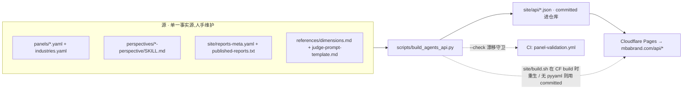

# 09 — For-Agents 机读层(/api + llms.txt + agents.html)

mbabrand.com 不只是给人看的报告站,也是给 **AI agent 直接调用**的品牌判断接口:
所有结构化内容在 build 时落成静态 JSON，挂在 `/api/*.json`，HTTP GET 直接拿,
CORS 全开、无 token。本文档说明这层的契约、数据来源、生成方式和一致性守卫。

> **单一事实源**:`site/api/*.json` 不是手写的,而是 `scripts/build_agents_api.py`
> 从仓库里的源文件生成的。改 API 内容 = 改源 + 重跑生成器 + commit,**不要手改 JSON**
> (CI 的漂移守卫会拒绝手改,见 §4)。

## 1. 发现入口(给 agent 的三个起点)

| 入口 | 用途 |
|---|---|
| [`/llms.txt`](../site/llms.txt) | LLM 友好的纯文本目录:一段话讲清 MBA 是什么 + 端点清单 + curl 速查 + 怎么触发 MBA |
| [`/api/index.json`](../site/api/index.json) | 机读 manifest:`counts` + 所有端点 URL + `cors` / `auth` / `format` / `discovery` |
| [`/agents.html`](../site/agents.html) | 给 agent 工程师看的接入指南(端点表 + curl 示例 + Claude Code 集成) |

## 2. 端点契约

所有端点:`GET`、`application/json; charset=utf-8`、`Access-Control-Allow-Origin: *`、无鉴权。

| 端点 | 内容 | 数据来源(源文件) |
|---|---|---|
| `/api/index.json` | manifest:counts + 端点表 + cors/auth/format | 生成器汇总(含 `generated_at` 时间戳) |
| `/api/about.json` | MBA 是什么 + team + stack + install + license | 生成器内置常量 |
| `/api/methodology.json` | 7 维度 + 5 镜头 + 5 阶段流水线 + panel 解析顺序 | `references/dimensions.md` + `references/judge-prompt-template.md` |
| `/api/reports.json` | 已发布报告列表(slug / 品牌 / 版本 / 总分 / TL;DR) | `site/reports-meta.yaml`(按 `published-reports.txt` 过滤) |
| `/api/reports/{slug}.json` | 单报告 meta + `html_url` + `pdf_url` + `panel_api_url` | `site/reports-meta.yaml` |
| `/api/panels.json` | 10 个内置 panel + 行业映射表 | `panels/*.yaml` + `panels/industries.yaml` |
| `/api/panels/{slug}.json` | 单 panel 的评委组成 + status | `panels/<slug>.yaml` |
| `/api/judges.json` | 15 个评委人物视角 skill | `perspectives/*-perspective/SKILL.md`(front matter) |
| `/api/judges/{slug}.json` | 单评委描述 + 来源 `skill_url` | `perspectives/<slug>-perspective/SKILL.md` |
| `/api/install.json` | 怎么把 MBA 装进 Claude Code(BotLearn / GitHub) | 生成器内置常量 |
| `/api/search.json` | 扁平语料(reports + panels + judges + dimensions + lenses),给客户端做 substring search | 上述汇总 |

curl 速查(更多见 `/llms.txt` 和 `/agents.html`):

```sh
curl -s https://mbabrand.com/api/index.json                       # 全站 manifest
curl -s https://mbabrand.com/api/reports.json | jq '.items[].slug'
curl -s https://mbabrand.com/api/panels/auto.json | jq '.judges[].display_name_cn'
curl -s https://mbabrand.com/api/judges/jobs.json | jq -r .description
```

## 3. 数据流:源 → 生成器 → /api



`scripts/build_agents_api.py`:

- **读** §2 表里列出的源文件,**写** `site/api/*.json`(每次先清空 `site/api/` 再全量生成,删掉的条目不会残留)。
- 被 `site/build.sh` 在 Cloudflare Pages build step 调用:build 环境**有 `pyyaml` 就重新生成**(`generated_at` 刷新成 build 时刻),**没有就回退用 committed 的 `site/api/*`**(所以离线 / 缺依赖也能发站)。
- 本地可独立跑:`python3 scripts/build_agents_api.py`。

## 4. 一致性守卫(CI 漂移检查)

因为 `site/api/*.json` 是 committed 的派生产物,**手改源却忘了重生成**会让 API 与源脱节。
CI(`.github/workflows/panel-validation.yml`)用一步守住:

```yaml
- name: Check agent API (site/api/*.json) in sync with sources
  run: python scripts/build_agents_api.py --check
```

`--check` 模式:在内存里重新生成,与 committed 的 `site/api/*.json` 逐文件比对,**不写任何文件**,
发现 `drift` / `missing` / `stale` 就退出 1 并列出文件。唯一被忽略的字段是 `index.json` 的
`generated_at`(墙钟时间戳,本身就该每次不同),其余必须逐字节一致。

本地等价命令:

```sh
python3 scripts/build_agents_api.py --check   # 退出 0 = 同步;退出 1 = 列出漂移文件
```

## 5. 怎么改 API(改源,别改 JSON)

| 想改什么 | 改哪个源 | 然后 |
|---|---|---|
| 加 / 改一个 panel | `metric-brand-auditor/panels/<slug>.yaml` | 重跑生成器 + commit `site/api/` |
| 加 / 改一个评委 | `perspectives/<slug>-perspective/SKILL.md`(front matter `name` / `description`) | 同上 |
| 7 维度 / 5 镜头措辞 | `references/dimensions.md` / `judge-prompt-template.md` | 同上 |
| 发布 / 更新一份报告 | `site/published-reports.txt`(加 slug)+ `site/reports-meta.yaml`(加一段 meta) | 同上(并把报告复制到 `published/reports/<slug>/`,见 [`site/README.md`](../site/README.md)) |
| about / install 文案 | `scripts/build_agents_api.py` 里的 `build_about()` / `build_install()` 常量 | 同上 |

标准流程:

```sh
# 1. 改源(panel / perspective / reports-meta / dimensions …)
# 2. 重新生成
python3 scripts/build_agents_api.py
# 3. 自检(可选,CI 也会跑)
python3 scripts/build_agents_api.py --check
# 4. commit 源 + site/api/ 一起提交
git add metric-brand-auditor/ perspectives/ site/ && git commit
```

> `reports-meta.yaml` 字段说明在文件头注释里;发布报告到站点的完整流程见 [`site/README.md`](../site/README.md)。

## 6. 边界

- `/api` 是**只读快照**,不是 live 服务:数据反映最近一次 build 的 committed 源,没有运行时计算。
- 触发一次新的审计仍然走 Claude Code skill(`/mba <brand>`),不是 HTTP API —— `/api` 只暴露**已产出**的报告与配置。
- 法律 / 免责声明随站点统一:评委头像 / 评分 / verdict 均为 AI 基于公开一手资料的 in-character 模拟,非本人真实意见;报告不构成投资建议。
