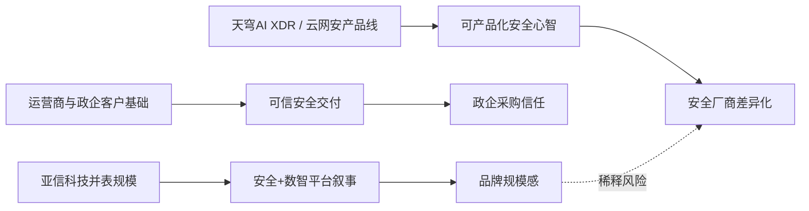

# Lead Synthesis — 亚信安全 (688225.SH)

**Brand:** 亚信安全  
**Slug:** `asiainfo-security`  
**Date:** 2026-05-18  
**Mode:** FRESH  
**Panel:** `security-cn-global`  
**Inputs:** open-web public sources + prior MBA AsiaInfo context  

## Executive Synthesis

1. **亚信安全的品牌底座是真实的网络安全软件能力，而不是临时包装。** 官网把自身定位为“云安全、终端安全、边界安全、身份安全和安全运营”等产品体系，公开产品页包括天穹 XDR 联动防御系统、终端安全、服务器深度安全防护、云主机安全、IAM / 4A 等能力。这说明它不是只有咨询方案的安全集成商，而是有软件产品矩阵的安全厂商。

2. **2024 年 11 月完成对亚信科技控股权收购后，品牌进入“双主语时代”。** 亚信安全公告和媒体报道显示，公司完成对亚信科技控股权收购，2025 年报称首次完整并表亚信科技，营业收入同比大幅增长至 77.41 亿元，归母净利润 4.46 亿元。但这也让“亚信安全”从纯网安品牌变成“安全 + 数智 + BSS / OSS / AI 运营”的合并叙事，安全心智被放大，也被稀释。

3. **品牌关键词很多，但真正能被市场复述的尖刀词还不够。** 官网和产品页反复出现“云网安一体化”“AI XDR”“天穹”“信舱”“身份安全”“大模型安全”“运营商安全”等词。问题不是没有技术词，而是这些词之间缺少一个能穿透 CIO / CISO 的主承诺：到底是“中国政企安全软件平台”，还是“运营商级安全运营平台”，还是“AI XDR 公司”？

4. **安全行业信任资产与上市公司财务信号开始重新对齐。** 2025 年报预告和解读口径显示，亚信科技并表带来规模和利润改善；但网络安全主业本身的增长、毛利、产品化比例、续约和客户结构仍需在年报细项中拆开验证。规模变大不等于安全品牌变强。

5. **与亚信科技的名称共振是双刃剑。** “亚信”有 30 年政企 / 运营商数字化资产，能给安全业务背书；但中文舆论容易把亚信科技的 BSS、数智运营、员工口碑、资本动作与亚信安全混在一起。对安全公司来说，混淆会损害“可信、专注、可托付”的核心。

## Leverage Map

## Fragile Edges

- **主语漂移：** “亚信安全”到底是网络安全公司，还是亚信科技的控股平台，还是安全 + 数智集团？主语不清会降低安全可信度。
- **品类锋利度不足：** 产品线完整，但没有形成类似 “EDR / XDR / SASE / Zero Trust / MDR” 那样清晰的外部锚点。
- **规模口径混合：** 并表后的 77.41 亿元收入提升品牌体量，但如果报告不拆分安全主业，会把“控股整合能力”误读成“安全产品竞争力”。
- **公开证据不足：** 客户案例、产品检测、独立评测、漏洞响应、攻防演练和续约数据需要更多公开、可引用证据。
- **商标与品牌混淆：** 亚信科技、亚信安全及“亚信”相关商业标识共用，会让外部把不同主体的声誉事件相互归因。

## Open Questions

1. 亚信安全网络安全主业在并表后收入、毛利、续约中的真实占比是多少？
2. “天穹 AI XDR”是否已有第三方评测、头部客户案例和可复用 SKU？
3. 运营商级安全经验能否迁移到金融、能源、政务、制造等非运营商客户？
4. 与亚信科技整合后，是安全能力赋能数智业务，还是安全品牌被数智业务吸收？
5. 市场是否真的把“亚信安全”识别为安全品牌，而不是“亚信系上市平台”？

## Citations Index

- 亚信安全官网：https://www.asiainfo-sec.com/
- 亚信安全产品页“亚信安全天穹 XDR 联动防御系统”：https://www.asiainfo-sec.com/product/detail-177.html
- 亚信安全产品体系页：https://www.asiainfo-sec.com/product
- 亚信安全投资者关系 / 公告页：https://www.asiainfo-sec.com/investor/notice
- 亚信安全关于完成对亚信科技控股权收购的公开报道与公告，2024-11
- 亚信安全 2025 年年度报告 / 业绩预告公开口径，2026
- 上交所 / 科创板公开信息：688225.SH
- MBA 橙仕汽车报告与亚信科技既有分析方法，MBA 项目：https://github.com/zhanglunet/mba ，官网：https://mbabrand.com
